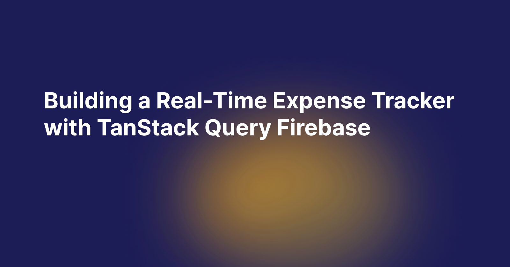

# Real-Time Expense Tracker App

A real-time tracker app with TanStack Query Firebase. This app will allow users to:

- Add, edit and delete expenses.

- Categorize expenses (Food, Rent, Travel, etc)

- View reports and with total expenses.

- Sync data in real-time with Firebase. 